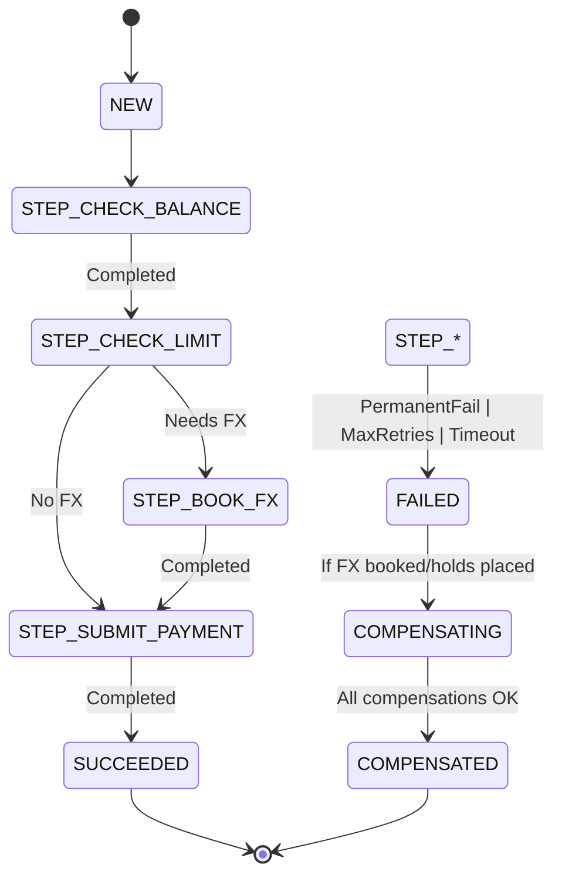
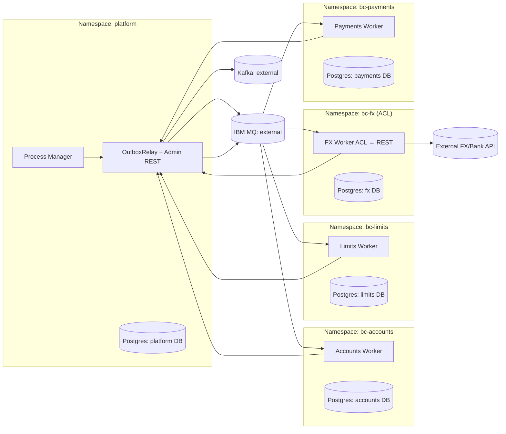
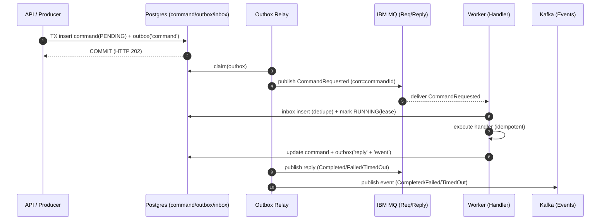

# Reliable Payments on OpenShift — Complete Blueprint
**Version:** 1.0  
**Date:** 2025-11-02

> End-to-end design for reliable commands and events across bounded contexts, with an explicit **Process Manager** for payment flows. Runs on **OpenShift**, uses **IBM MQ** for commands/replies, **Kafka** for events, and **Postgres** for authoritative state.

---

## Table of Contents
1. Introduction & Narrative — Building Reliability from First Principles
2. Deployment & Data Architecture on OpenShift
3. Orchestrated Payments over Reliable Messaging (Process Manager)
4. Appendix A — Why This Reliable Messaging Architecture Works
5. Appendix B — Payment Process Manager Details (steps, state, batch)
6. Reference Envelopes & DDL (inline within chapters)

---

# 1) Introduction & Narrative — Building Reliability from First Principles
# Reliable Payments on OpenShift
**Buses:** IBM MQ for commands/replies • Kafka for events  
**Source of truth:** Postgres (platform and per bounded context)  
**Coordinator:** Process Manager (explicit orchestration)

---

## Prologue — What “reliability” means
When a customer schedules a payment, three guarantees must hold even under crashes, redeliveries, and network faults:

1) **Durable acceptance.** We can prove when the request was accepted and what it asked for.  
2) **Single business effect.** Duplicate deliveries never produce duplicate side‑effects.  
3) **Communicated outcome.** Callers receive a definitive result; downstream systems can react.

This document walks from the foundations (idempotency and delivery) to a **reliable messaging substrate**, and then to a **Process Manager** that coordinates payment flows. It concludes with deployment and operations guidance for OpenShift.

---

## 1. Failure modes and their remedies
- **Dual‑write race (DB + message).** A DB update can succeed while message publish fails (or vice versa).  
  **Remedy:** **Transactional Outbox** — write business change and an outbox record in a single DB transaction; publish after commit.

- **Redelivery and retries.** Brokers and clients re‑send messages.  
  **Remedy:** **Idempotent Receiver (Inbox)** — record `(messageId, handler)` before side‑effects and ignore duplicates.

- **Crash after commit but before publish.** We updated state but never sent a reply/event.  
  **Remedy:** persist replies/events into the **outbox** inside the same transaction; a **Relay** publishes later.

- **Long‑running steps and timeouts.** Downstream services may hang.  
  **Remedy:** use a **lease** on the command; a **watchdog** marks `TIMED_OUT` and emits a conclusive outcome.

- **Persistent failure or prolonged downstream outage.** Repeated attempts keep failing (e.g., HTTP 5xx, timeouts).  
  **Remedy:** **Dead Letter Channel (DLQ)** — after a **configured max retry/backoff policy** is exceeded (broker‑level and/or application‑level), park the item in DLQ with the last error and attempts; operators can resubmit when conditions improve.

---

## 2. Core principles
1) **Truth first, publish later.** The DB commit is the moment of truth.  
2) **Idempotency by design.** Every effect is guarded by an `idempotencyKey` and a uniqueness constraint where the effect lands.  
3) **Assume at‑least‑once delivery.** Design for exactly‑once **business effects**.  
4) **Durable replies/events.** Outcomes are persisted before publishing.  
5) **Deterministic correlation.** Each message carries `correlationId` (process id) and `causationId` (parent).

---

## 3. Patterns that fit payments
### 3.1 Transactional Outbox
Accepting a command writes `command(PENDING)` **and** an `outbox` row (category=`command`) in one transaction. A Relay publishes after commit (fast path) and repairs misses (sweeper).

### 3.2 Idempotent Receiver (“Inbox”)
On delivery, insert into `inbox(message_id, handler)`. New row → process; conflict → duplicate, skip.

### 3.3 Request/ack and request/reply
- **ACK (HTTP 202):** “request durably accepted.”  
- **Reply (MQ):** “completed / failed / timed out.”  
Clients may poll, listen for replies, or subscribe to Kafka events.

### 3.4 DLQ with bounded retry
- **Transient errors:** retry with exponential backoff (both broker and application policies).  
- **Persistent failures/downstream outages:** after **N** attempts or a **max backoff window**, **park to DLQ** with diagnostic context. Resubmission is safe due to idempotency.

### 3.5 Process Manager (explicit orchestration)
A small service that remembers state and decides the next command in a business process. For payments: **balance → limit → (optional) FX → submit**; compensations when necessary.

---

## 4. A day in the life of a payment
1) API validates and commits `command + outbox(CommandRequested)`; client receives **HTTP 202**.  
2) Relay publishes to **IBM MQ**.  
3) Worker consumes, writes **inbox**, marks **RUNNING** with a lease, executes idempotently, then commits `command` result and outbox rows for **reply** and **event**.  
4) Relay publishes the reply to MQ and the event to Kafka.  
5) **Process Manager** consumes replies and issues the next command until the payment is **SUCCEEDED** or ends in **FAILED/TIMED_OUT** (with compensation where needed).  
6) If repeated failures occur (e.g., downstream outage), retries are attempted per policy; upon exhaustion, the item is **parked in DLQ** for operator action.

---

## 5. The data we keep
### Platform (shared)
- `command` — lifecycle and leases.  
- `outbox` — messages pending publication (commands, replies, events).  
- `inbox` — dedupe for platform‑addressed messages.  
- `command_dlq` — parked items with attempts and last error.  
- `process_instance`, `process_log` — Process Manager state and journal.  
- `batch_run`, `batch_item` — daily batch tracking.

### Each bounded context
- Domain tables.
- Idempotency ledgers (e.g., `payment_submission(idempotency_key UNIQUE)`).

---

## 6. Process Manager for payments
**Flow:** CheckBalance → CheckDailyLimit → (BookFxContract?) → SubmitPayment; compensate (e.g., CancelFxContract) when necessary.  
**Decisions:** advance on **CommandCompleted** replies; on **CommandFailed/TimedOut**, evaluate retry vs compensation vs fail; record every decision in `process_log`.  
**Batches:** one `process_instance` per payment; items roll up to a `batch_run` for the day.

State reference:


---

## 7. OpenShift deployment (minimal, isolated)
One **platform** namespace: Process Manager, Outbox Relay, and platform Postgres.  
One namespace **per bounded context**: worker + its DB. External MQ and Kafka.



**Why this shape works:** autonomy per team, failure isolation, least‑privilege networking, horizontal scale for workers and Relay.

---

## 8. Operations and testing
**Dashboards:** outbox backlog, inbox dedupe hits, active/failed processes, batch progress, MQ queue depth, DLQ depth.  
**Alerts:** publish failures, backout spikes, stalled processes, repeatedly deferred outbox rows.  
**Runbooks:** DLQ resubmit; resume current step; compensate and abort; force‑complete with external proof.  
**Retention:** partition/purge outbox/inbox/process_log/batch_item; export summaries to analytics.

**Tests (with Testcontainers):**
1) Happy path inc. FX — assert rows, MQ reply, Kafka event.  
2) Retryable failure — redelivery deduped, final success.  
3) Persistent failure — DLQ after N attempts, resubmit path.  
4) Timeout — watchdog marks `TIMED_OUT`, policy applied.  
5) Duplicate submission — idempotency key blocks double side‑effects.

---

## 9. Minimal envelope (copy/paste)
```json
{
  "messageId": "uuid",
  "type": "CommandRequested|CommandCompleted|CommandFailed|CommandTimedOut",
  "name": "CheckBalance|CheckDailyLimit|BookFxContract|SubmitPayment",
  "commandId": "uuid",
  "correlationId": "uuid",
  "causationId": "uuid",
  "occurredAt": "2025-11-02T12:34:56Z",
  "key": "paymentId",
  "headers": {
    "replyTo": "APP.CMD.REPLY.Q",
    "tenantId": "acme",
    "schemaVersion": "1",
    "idempotencyKey": "processId:STEP_NAME",
    "traceId": "otlp-trace-id",
    "spanId": "otlp-span-id"
  },
  "payload": "{...domain-json...}"
}
```

---

### Closing
The platform commits truth first, publishes later, dedupes deliveries, and records every decision. With a Process Manager that advances steps and clear DLQ policies that park items after bounded retries, the system remains predictable, auditable, and safe to operate at scale.


---

# 2) Deployment & Data Architecture on OpenShift
# OpenShift Deployment & Database Architecture for Reliable Payments Platform
**Pattern:** Outbox–Inbox Dual‑Bus (IBM MQ for commands/replies, Kafka for events, Postgres for state)  
**Scope:** Shared infrastructure on OpenShift, multiple bounded contexts (some ACLs that call external APIs), Process Manager/Saga orchestration, batch tracking, operator controls.

---

## 1) High‑level: What we’re deploying
- **Shared “platform”** namespace with:  
  - **Orchestrator (Process Manager / Saga)** — coordinates multi‑step payment flows.  
  - **OutboxRelay + Admin REST** — publishes outbox rows to MQ/Kafka, provides resubmit/DLQ/health endpoints.  
  - **Platform Postgres** — authoritative store for `command`, `outbox`, `inbox`, `command_dlq`, `saga_*`, `batch_*`.
- **Multiple bounded contexts (BCs)**, each in **its own namespace** (e.g., Accounts, Limits, FX, Payments).  
  Each BC: a **Worker** service consuming MQ commands, using **its own DB** (or schema on a shared cluster) for local state, `inbox_bc`, and `outbox_bc`.  
- **External MQ/Kafka** clusters — no OpenShift operators required; apps connect as clients.  
- **ACL BCs** (e.g., FX) translate **MQ → REST** to external APIs with retries/circuit‑breakers.

### Diagram
```mermaid
flowchart LR
  subgraph ns-platform["Namespace: platform (shared)"]
    REL[OutboxRelay + Admin REST]
    ORCH[Process Manager / Saga Orchestrator]
    PG0[(Postgres: orchestrator DB)]
    CM[ConfigMaps / Secrets]
  end

  subgraph ns-accounts["Namespace: bc-accounts"]
    ACCSVC[Accounts Service (Worker)]
    PG1[(Postgres: accounts DB)]
  end

  subgraph ns-limits["Namespace: bc-limits"]
    LIMSVC[Limits Service (Worker)]
    PG2[(Postgres: limits DB)]
  end

  subgraph ns-fx["Namespace: bc-fx (ACL)"]
    FXSVC[FX Service (ACL Worker)]
    PG3[(Postgres: fx DB)]
  end

  subgraph ns-payments["Namespace: bc-payments"]
    PAYSVC[Payments Service (Worker)]
    PG4[(Postgres: payments DB)]
  end

  KAFKA[(Kafka: external)]
  MQ[(IBM MQ: external)]
  EXTAPI[(External FX/Bank API)]

  ORCH -->|commands via outbox→| REL
  REL -->|publish| MQ
  MQ -->|CommandRequested| ACCSVC & LIMSVC & FXSVC & PAYSVC
  ACCSVC & LIMSVC & FXSVC & PAYSVC -->|reply/event via outbox→| REL
  REL -->|publish replies| MQ
  REL -->|publish events| KAFKA

  FXSVC -->|HTTPS (ACL)| EXTAPI

  ORCH --- PG0
  ACCSVC --- PG1
  LIMSVC --- PG2
  FXSVC --- PG3
  PAYSVC --- PG4
```

---

## 2) Database ownership model
**Why per‑BC DB (or schema) matters**
- **Autonomy & blast radius** — each BC evolves tables/indexes independently; failures don’t cascade.  
- **Local durability** — BCs write `inbox_bc` (dedupe) and `outbox_bc` (replies/events) in the same TX as domain state.  
- **Clarity** — per‑domain audit & forensics.

### Platform DB (owned by platform)
Holds shared infra + orchestration:
- `command`, `outbox`, `inbox`, `command_dlq`  
- `saga_instance`, `saga_log`  
- `batch_run`, `batch_item`

### Each BC DB (owned by BC)
- Domain tables
- Optional idempotency ledger (e.g., `payment_submission(idempotency_key unique)`).

> If corporate runs a central Postgres: use **separate databases or schemas** with roles; enforce isolation via roles/RLS.

---

## 3) Canonical data schemas (DDL snippets)

### Platform DB
```sql
create table command (
  id uuid primary key,
  name text not null,
  tenant_id text,
  business_key text,
  status text not null,           -- PENDING|RUNNING|SUCCEEDED|FAILED|TIMED_OUT
  retries int not null default 0,
  lease_until timestamptz,
  requested_at timestamptz not null default now(),
  completed_at timestamptz,
  last_error text
);

create table outbox (
  id bigserial primary key,
  category text not null,         -- 'command'|'reply'|'event'
  topic text,
  key text,
  type text not null,
  payload jsonb not null,
  headers jsonb not null default '{}',
  status text not null default 'NEW', -- NEW|PUBLISHED|FAILED
  attempts int not null default 0,
  next_at timestamptz,
  created_at timestamptz not null default now()
);
create index outbox_dispatch_idx on outbox(status, coalesce(next_at,'epoch'::timestamptz), created_at);

create table inbox (
  message_id text not null,
  handler text not null,
  processed_at timestamptz not null default now(),
  primary key(message_id, handler)
);

create table command_dlq (
  command_id uuid primary key,
  parked_at timestamptz not null default now(),
  parked_by text,
  attempts int not null,
  error text
);

create table saga_instance (
  saga_id uuid primary key,
  saga_type text not null,                  -- "PaymentExecution"
  tenant_id text,
  business_key text not null,               -- paymentId or batchId:paymentId
  status text not null,                     -- NEW|RUNNING|SUCCEEDED|FAILED|COMPENSATING|COMPENSATED|PAUSED
  step text not null,                       -- STEP_CHECK_BALANCE|...|STEP_SUBMIT_PAYMENT
  data jsonb not null default '{}'::jsonb,  -- fx rate, holds, approvals
  retries int not null default 0,
  updated_at timestamptz not null default now()
);

create table saga_log (
  saga_id uuid not null,
  seq bigint generated always as identity,
  at timestamptz not null default now(),
  entry jsonb not null,
  primary key (saga_id, seq)
);

create table batch_run (
  batch_id uuid primary key,
  scheduled_for date not null,
  tenant_id text,
  status text not null,                      -- NEW|RUNNING|PARTIAL|SUCCEEDED|FAILED
  counts jsonb not null default '{}'::jsonb,
  created_at timestamptz not null default now()
);

create table batch_item (
  batch_id uuid not null,
  item_id uuid not null,                     -- paymentId
  tenant_id text,
  status text not null,                      -- NEW|RUNNING|SUCCEEDED|FAILED|TIMED_OUT
  last_error text,
  saga_id uuid,
  primary key (batch_id, item_id)
);
```

### BC DB (per bounded context)
```sql
-- Example: enforce idempotent side effect in Payments BC
create table payment_submission (
  id uuid primary key,
  payment_id uuid not null,
  idempotency_key text not null unique,   -- sagaId:STEP_SUBMIT_PAYMENT
  submitted_at timestamptz not null default now()
);
```

**Ops advice**: Partition `outbox`, `inbox`, `saga_log`, `batch_item` **by day**; set `fillfactor ~90`; tighten autovacuum on hot tables; add retention/purge jobs.

---

## 4) Envelope & tracing
```json
{
  "messageId": "uuid",
  "type": "CommandRequested|CommandCompleted|CommandFailed|CommandTimedOut",
  "name": "CheckBalance|CheckDailyLimit|BookFxContract|SubmitPayment|...",
  "commandId": "uuid",
  "correlationId": "uuid",          // sagaId for orchestration
  "causationId": "uuid",
  "occurredAt": "2025-11-02T12:34:56Z",
  "key": "paymentId or accountId",
  "headers": {
    "replyTo": "APP.CMD.REPLY.Q",
    "tenantId": "acme",
    "schemaVersion": "1",
    "idempotencyKey": "sagaId:STEP_NAME",
    "traceId": "otlp-trace-id",
    "spanId": "otlp-span-id"
  },
  "payload": "{...domain-json...}"
}
```
- **MQ:** set `JMSCorrelationID = commandId`, `JMSReplyTo = headers.replyTo`.  
- **Kafka:** include `correlationId` and tracing headers; choose keys that match your read side (e.g., `business_key`).

---

## 5) ACL (MQ→REST) bounded contexts
- **Resilience:** Resilience4j timeouts, bounded retries, circuit breaker, bulkhead.  
- **Idempotency:** propagate `idempotencyKey` if the external API supports it; otherwise keep a local ledger to avoid duplicate side‑effects.  
- **Security:** OAuth2 client credentials or mTLS; rotate via pipelines; store in OpenShift Secrets/SealedSecrets.  
- **Mapping:** strict JSON schema validation on inbound command; normalize external errors to `CommandFailed`.
- **Observability:** correlate with `correlationId` (sagaId), record request/response metadata (no PII).

---

## 6) OpenShift resources & policies
- **Deployments**: Orchestrator, OutboxRelay, Workers per BC.  
- **HPA**: scale on CPU + custom metrics: MQ queue depth, outbox backlog, saga active count.  
- **PDB**: e.g., minAvailable=1 (2 for platform components).  
- **NetworkPolicies**: egress only to MQ/Kafka/own DB/whitelisted external APIs; ingress restricted (Router for admin/UI).  
- **Secrets/ConfigMaps**: JMS CCDT, Kafka SASL/TLS, DB creds, CA certs.  
- **TLS**: MQ channels with TLS; Kafka SASL/SCRAM or mTLS; DB TLS.  
- **Rollouts**: maxUnavailable=0 for Relay/Orchestrator; blue/green for BCs when needed.

---

## 7) Responsibilities split
| Component | Owns tables | Publishes | Consumes |
|---|---|---|---|
| **Orchestrator (platform)** | command/outbox/inbox, saga_*, batch_* | MQ **commands** | MQ **replies**, Kafka **events** |
| **OutboxRelay (platform)** | (reads platform outbox) | MQ **commands/replies**, Kafka **events** | platform outbox |
| **Accounts Worker** | domain | MQ **reply**, Kafka **event** | MQ **command** |
| **Limits Worker** | domain | MQ **reply**, Kafka **event** | MQ **command** |
| **FX Worker (ACL)** | domain(opt) | MQ **reply**, Kafka **event** | MQ **command** → **HTTPS** |
| **Payments Worker** | domain | MQ **reply**, Kafka **event** | MQ **command** |

**Note:** All BCs use the shared `outbox` and `inbox` tables for reliable message publishing and idempotent processing.

---

## 8) Scaling & failure domains
- **Relay**: horizontal scale; uses `FOR UPDATE SKIP LOCKED` to claim outbox rows; at least **2 pods**.  
- **Orchestrator**: active/active (competing claims) or leader‑elected via DB lock.  
- **Workers**: scale per BC; tune MQ prefetch/concurrency; ensure idempotent handlers.  
- **DB**: managed Postgres recommended; else StatefulSets with PVs and scheduled backups; WAL on SSD.  
- **Brokers**: externally managed Kafka/MQ; validate quotas & HA.

---

## 9) Operations (SRE) playbook
- **Dashboards**: outbox backlog, inbox dedupe hits, saga active/failed, batch progress, MQ queue depth, DLQ depth.  
- **Alerts**: relay publish failures, MQ backout spikes, saga stalled (no step progress), outbox next_at repeatedly deferred.  
- **Runbooks**: DLQ resubmit; resume saga step; compensate and abort; force‑complete based on external evidence.  
- **Retention**: purge old partitions (outbox/inbox/saga_log/batch_item); export summaries to data lake.  
- **Compliance**: immutable `saga_log`, durable `command` lifecycle; Kafka event retention as per policy.

---

## 10) Variants
### A. Strict autonomy (recommended)
- Each BC has **its own DB** (or schema) with `inbox_bc` + `outbox_bc`.  
- Orchestrator has its own platform DB.  
- **Pros:** isolation, performance, clean ownership.  
- **Cons:** more DB endpoints to manage.

### B. Shared infra DB (centralized control plane)
- Platform DB holds inbox/outbox for **all** services; BCs call platform over HTTP/gRPC to record inbox/outbox.  
- **Pros:** one DB to manage.  
- **Cons:** tighter coupling, potential bottleneck; higher latency; new dependency path.

---

## 11) Payment orchestration (reference)
See **Appendix B — Payment Saga** for state machine and sequence. Key contract:
- **Per step idempotency**: `headers.idempotencyKey = sagaId:STEP`.  
- **Correlation**: `correlationId = sagaId` across MQ & Kafka.  
- **Batch**: parent `batch_run` and `batch_item` rows track daily runs; completion when all items terminal.

---

## 12) Minimal end‑to‑end test plan (OpenShift‑friendly)
- **Testcontainers profile** (local CI): Postgres, Redpanda (Kafka), IBM MQ container → run:  
  1) Happy path (incl. FX) — assert: `command`, MQ reply, Kafka event, `saga_instance`, `batch_item`.  
  2) Retryable fail — simulate redelivery; verify inbox dedupe + final success.  
  3) Permanent fail — verify DLQ + operator resubmit.  
  4) Timeout — watchdog marks `TIMED_OUT`; orchestrator policy applied.  
  5) Duplicate submission — idempotencyKey prevents double side‑effects.  

- **Cluster smoke**: deploy minimal BC stubs; drive 100 TPS for 10 minutes; watch outbox backlog, MQ depth, saga latencies.

---

## 13) Why this architecture wins (business & risk)
- **Reliability without XA**: atomic DB write + outbox; inbox dedupe; durable replies/events.  
- **Operator‑first**: DLQ, resubmit, batch visibility, saga logs.  
- **Secure & compliant**: least‑privilege network, TLS, per‑tenant headers, auditable DB trails.  
- **Scales naturally**: add workers; relay scales out; no tight coupling.  
- **Works with ACLs**: MQ commands can translate to REST safely with idempotency & circuit breakers.

---

## 14) Copy‑paste command envelopes (Java/Python interop)
```json
{
  "messageId": "uuid",
  "name": "SubmitPayment",
  "type": "CommandRequested",
  "commandId": "uuid",
  "correlationId": "uuid",           // sagaId
  "key": "paymentId",
  "occurredAt": "2025-11-02T12:34:56Z",
  "headers": {
    "replyTo": "APP.CMD.REPLY.Q",
    "tenantId": "acme",
    "schemaVersion": "1",
    "idempotencyKey": "sagaId:STEP_SUBMIT_PAYMENT",
    "traceId": "otlp-trace-id"
  },
  "payload": {
    "paymentId": "uuid",
    "amount": {"currency":"USD","value":"100.00"},
    "beneficiary": {"iban":"...", "name":"..."},
    "instructions": {"priority":"HIGH"}
  }
}
```

---

### Closing note
This package is designed for **OpenShift with limited cluster privileges**: all components are pure Deployments with ConfigMaps/Secrets and external broker endpoints. It preserves **bounded‑context autonomy**, provides a **single shared orchestration platform**, and delivers **reliable, auditable, and scalable** payment processing.


---

# 3) Orchestrated Payments over Reliable Messaging (Process Manager)
# Orchestrated Payments over Reliable Messaging
### (Shared Infra on OpenShift + Process Manager / Saga on Dual-Bus MQ/Kafka)
**Author:** Igor Music  
**Date:** 2025  
**Status:** Production-ready blueprint (builds on Reliable Command & Event Pipeline)

---

## 1. Intent
Provide a **shared reliable-messaging infrastructure** (inbox/outbox/relay) that multiple **bounded contexts** (BCs) can use over **IBM MQ** (commands/replies) and **Kafka** (events), and layer a **Process Manager / Saga** that coordinates **multi-step payment orchestration** across BCs with **idempotency, retries, compensation, batch tracking**, and **operator restart from DLQ**.

---

## 2. Context
- Platform: **OpenShift**; limited operator privileges (deploy by CI/CD images).
- Transports: **IBM MQ** (command request/reply) + **Kafka** (domain events).
- Persistence: **Postgres** (command, inbox, outbox, saga, batch, DLQ).
- Interop: **Java** (Micronaut 4, JMS, Kafka) and **Python** handlers.
- Business: **Daily payment scheduling**: for each scheduled payment, orchestrate checks and side effects across BCs:
  1) **Accounts**: available balance
  2) **Limits**: daily limit check
  3) **FX**: book FX for international wires
  4) **Payments**: submit payment for execution

Any step can **fail**, be **retried**, or require **compensation**; operators must be able to **resume** from DLQ.

---

## 3. Problem
Coordinate **reliable, exactly-once-at-business-level** multi-step workflows spanning multiple services with **no XA/2PC**, ensuring:
- Commands are **durably accepted** and **deduplicated** on delivery.
- **Synchronous ACK** on submit; **asynchronous completion replies** and **events**.
- **Batch** visibility for “Payments scheduled for day D” with per-item status.
- **Operator** tools to **resubmit** or **compensate** safely.

---

## 4. Solution Overview
Use the **Reliable Command & Event Pipeline** (Transactional Outbox + Inbox + Dual-Bus) as the **shared infra**. Add **Saga tables** and an **Orchestrator** service that:
- Creates a **saga instance per payment** (correlationId = sagaId).
- Issues **commands** to BC queues via the same **CommandBus** (DB insert + outbox fast path → MQ).
- Listens to **MQ replies** and **Kafka events** to drive the **saga state machine**.
- Records **batch items** and exposes **operator endpoints** to **retry/skip/compensate**.

---

## 5. Data Model (Postgres)

### 5.1 Core reliable messaging (unchanged)
- `command(id, name, business_key, status, retries, lease_until, last_error, reply, ...)`
- `inbox(message_id, handler, processed_at)`
- `outbox(id, category, topic, key, type, payload, headers, status, attempts, next_at, ...)`
- `command_dlq(command_id, ..., error, attempts, parked_by, ...)`

### 5.2 Saga & batch
```sql
create table saga_instance (
  saga_id uuid primary key,
  saga_type text not null,                  -- "PaymentExecution"
  tenant_id text,
  business_key text not null,               -- paymentId or batchId:paymentId
  status text not null,                     -- NEW|RUNNING|SUCCEEDED|FAILED|COMPENSATING|COMPENSATED|PAUSED
  step text not null,                       -- STEP_CHECK_BALANCE | STEP_CHECK_LIMIT | STEP_BOOK_FX | STEP_SUBMIT_PAYMENT
  data jsonb not null default '{}'::jsonb,  -- working context (fx rate, holds, approvals)
  retries int not null default 0,
  updated_at timestamptz not null default now()
);

create table saga_log (
  saga_id uuid not null,
  seq bigint generated always as identity,
  at timestamptz not null default now(),
  entry jsonb not null,
  primary key (saga_id, seq)
);

create table batch_run (
  batch_id uuid primary key,
  scheduled_for date not null,
  tenant_id text,
  status text not null,                      -- NEW|RUNNING|SUCCEEDED|PARTIAL|FAILED
  counts jsonb not null default '{}'::jsonb, -- {total, running, succeeded, failed}
  created_at timestamptz not null default now()
);

create table batch_item (
  batch_id uuid not null,
  item_id uuid not null,                     -- paymentId
  tenant_id text,
  status text not null,                      -- NEW|RUNNING|SUCCEEDED|FAILED|TIMED_OUT
  last_error text,
  saga_id uuid,
  primary key (batch_id, item_id)
);
```

**Indexes:** add `(status)` and `(updated_at)` on `saga_instance`; `(status, created_at)` on `outbox`; and FK/tenant filters as needed.

---

## 6. Messaging Contracts

### 6.1 Envelope (JSON, stable)
```json
{
  "messageId": "uuid",
  "type": "CommandRequested|CommandCompleted|CommandFailed|CommandTimedOut",
  "name": "CheckBalance|CheckDailyLimit|BookFxContract|SubmitPayment|...",
  "commandId": "uuid",
  "correlationId": "uuid",           // sagaId
  "causationId": "uuid",
  "occurredAt": "2025-11-02T12:34:56Z",
  "key": "paymentId or accountId",
  "headers": {
    "replyTo": "APP.CMD.REPLY.Q",
    "tenantId": "acme",
    "schemaVersion": "1",
    "idempotencyKey": "sagaId:STEP_NAME"
  },
  "payload": "{...}"
}
```

**IBM MQ:** `JMSCorrelationID = commandId`, `JMSReplyTo = headers.replyTo`  
**Kafka:** publish events with `correlationId = sagaId`

### 6.2 Queue & topic conventions
```
# Commands (IBM MQ)
APP.CMD.ACCOUNTS.CheckBalance.Q
APP.CMD.LIMITS.CheckDailyLimit.Q
APP.CMD.FX.BookFxContract.Q
APP.CMD.FX.CancelFxContract.Q
APP.CMD.PAYMENTS.SubmitPayment.Q

APP.CMD.REPLY.Q        # shared reply queue for completion

# Events (Kafka)
events.Accounts
events.Limits
events.Fx
events.Payments
events.Orchestrations   # optional (saga state changes)
```

---

## 7. Orchestrator Behavior

### 7.1 Batch start
1) `RunScheduledPaymentsForDay(D)` selects payments → creates `batch_run` and one **saga per payment**.  
2) For each payment/saga:
   - `step = STEP_CHECK_BALANCE`
   - Send command `CheckBalance` (idempotencyKey = `sagaId:STEP_CHECK_BALANCE`).

### 7.2 Driving the saga
On **MQ reply** (Completed/Failed/TimedOut) or **Kafka events** (optional enrichment), orchestrator updates `saga_instance` and issues the **next command**:

- After **CheckBalance → Completed**: `STEP_CHECK_LIMIT` → send `CheckDailyLimit`  
- After **CheckDailyLimit → Completed**:
  - If international: `STEP_BOOK_FX` → send `BookFxContract`
  - Else: `STEP_SUBMIT_PAYMENT` → send `SubmitPayment`
- After **BookFxContract → Completed**: `STEP_SUBMIT_PAYMENT` → send `SubmitPayment`
- After **SubmitPayment → Completed**: `status = SUCCEEDED`; mark `batch_item = SUCCEEDED`

### 7.3 Failures & timeouts
- **Retryable**: bump `saga_instance.retries`, **re-send current step** (same idempotencyKey).  
- **Permanent**: if FX was booked, **compensate** (`CancelFxContract`), then mark `FAILED`.  
- **Timeout**: treat as failure with policy; operator may **resume**.

### 7.4 Operator actions
- **Resubmit step** (uses same `idempotencyKey`): safe replay.  
- **Skip to next** (advanced users): record in `saga_log`.  
- **Compensate & abort**: send `CancelFxContract` etc., mark `COMPENSATED`.

---

## 8. Idempotency & Dedupe
- **Inbox table**: first-write-wins per `(messageId, handler)` for MQ deliveries.  
- **Idempotency key per step**: `UNIQUE` in each BC’s side-effect tables (e.g., `payment_submission(idempotency_key)`), so replays are no-ops.  
- **Outbox/fast path**: command send and replies/events are **DB-atomic** then published.

---

## 9. Mermaid — Orchestration Sequence

```mermaid
sequenceDiagram
  autonumber
  participant ORCH as Orchestrator (Process Manager)
  participant PG as Postgres (saga/command/inbox/outbox)
  participant REL as OutboxRelay (fast path + sweep)
  participant MQ as IBM MQ (Req/Reply)
  participant ACC as Accounts BC
  participant LIM as Limits BC
  participant FX as FX BC
  participant PAY as Payments BC
  participant K as Kafka (events)

  ORCH->>PG: insert saga_instance(NEW→STEP_CHECK_BALANCE)\n+ command + outbox(CheckBalance)
  PG-->>ORCH: COMMIT
  ORCH->>REL: after-commit fast path publish
  REL->>MQ: send CheckBalance (corr=sagaId)

  MQ-->>ACC: deliver CheckBalance
  ACC->>PG: inbox dedupe + mark RUNNING
  ACC->>ACC: execute check
  ACC->>PG: set SUCCEEDED + outbox(reply Completed) + outbox(event)
  REL->>MQ: send reply Completed ; REL->>K: event
  MQ-->>ORCH: reply Completed

  ORCH->>PG: step=STEP_CHECK_LIMIT\n+ command + outbox(CheckDailyLimit)
  REL->>MQ: send CheckDailyLimit
  MQ-->>LIM: deliver CheckDailyLimit
  LIM->>PG: inbox + RUNNING -> SUCCEEDED + outbox(reply,event)
  REL->>MQ: reply Completed ; REL->>K: event
  MQ-->>ORCH: reply Completed

  alt International wire
    ORCH->>PG: step=STEP_BOOK_FX\n+ command + outbox(BookFxContract)
    REL->>MQ: send BookFxContract
    MQ-->>FX: deliver BookFxContract
    FX->>PG: inbox + RUNNING -> SUCCEEDED + outbox(reply,event)
    REL->>MQ: reply Completed ; REL->>K: event
    MQ-->>ORCH: reply Completed
  end

  ORCH->>PG: step=STEP_SUBMIT_PAYMENT\n+ command + outbox(SubmitPayment)
  REL->>MQ: send SubmitPayment
  MQ-->>PAY: deliver SubmitPayment
  PAY->>PG: inbox + RUNNING -> SUCCEEDED + outbox(reply,event)
  REL->>MQ: reply Completed ; REL->>K: event

  MQ-->>ORCH: reply Completed
  ORCH->>PG: saga.status=SUCCEEDED ; batch_item=SUCCEEDED
```

---

## 10. Mermaid — Saga State Machine


---

## 11. Operational Guidance
- **Retention & partitioning**: partition `outbox`, `inbox`, `saga_log` by day; purge published/outdated rows.  
- **Backoff**: relay uses exponential backoff on publish errors; MQ DLQ policy configured (backout count).  
- **Observability**: emit `saga_step_latency_ms`, `saga_retries_total`, `outbox_publish_latency_ms`, `inbox_dedupe_hits_total`; trace with `correlationId=sagaId`.  
- **Security/tenancy**: propagate `tenantId` in headers; enforce DB RLS if needed.

---

## 12. Consequences
### Benefits
- **Uniform reliability** for all BCs (shared infra); **low-latency** after-commit publishing.
- **Clear orchestration** with **resume/compensation** and **batch visibility**.
- **Exactly-once at business level** via inbox + idempotency keys in each BC.
- **Auditable** end-to-end via relational tables.

### Trade-offs
- Additional infra tables & relay process to operate.
- BCs must implement **idempotent side effects** (UNIQUE by `idempotencyKey`).

---

## 13. Related & Foundations
- **Reliable Command & Event Pipeline** (Outbox–Inbox Dual-Bus).  
- EIP: *Command Message, Request–Reply, Dead Letter Channel, Idempotent Receiver*.  
- DDD: *Process Manager / Saga*, *Event-Carried State*, *Compensation*.  

---

## 14. Summary
This blueprint turns your reliable messaging layer into a **shared platform** on OpenShift and adds a **first-class orchestration capability**.  
It coordinates multi-BC payment execution with **retries, compensation, and operator control**, while preserving **strong consistency and auditability** without XA.


---

# Appendix A — Why This Reliable Messaging Architecture Works
# Appendix A — Why This Reliable Messaging Architecture Works
**From the problem to the solution, with a teach‑and‑convince narrative**  
**Pattern:** Outbox–Inbox Dual‑Bus (IBM MQ for commands, Kafka for events, Postgres for state)

---

## 1) The problem we’re actually solving
Distributed systems must accept a command, execute it **once at the business level**, and communicate the outcome reliably — even if nodes crash, pods restart, messages are redelivered, networks partition, or downstreams time out. A naive dual‑write of “DB change + message publish” risks inconsistency if one side succeeds and the other fails. Traditional **XA/2PC** tries to make the two writes atomic, but it couples systems, adds latency, and is fragile at scale.

**We need:** local transactions, durable intent, reliable messaging, idempotent execution, and an audit trail — not a global lockstep commit.

---

## 2) Design in one sentence
**Write the truth once (in Postgres) and let everything else flow from it.**  
We persist the command and an **outbox** record in the **same transaction**, then publish from the outbox to IBM MQ (commands/replies) and to Kafka (events). Consumers use an **inbox** to deduplicate deliveries and run **idempotent** handlers. No XA needed.

---

## 3) End‑to‑end flow (concise)
1. **Accept** command (REST or internal): validate, then in **one DB transaction** insert into `command` and `outbox(category='command')`. Respond **HTTP 202**.  
2. **Publish (fast path)**: after commit, a relay publishes that outbox row to **IBM MQ** (`CommandRequested`).  
3. **Execute**: MQ worker first inserts into **`inbox`** `(message_id, handler)`; on first delivery it marks the command `RUNNING` with a lease, executes idempotently.  
4. **Complete**: worker updates `command` to `SUCCEEDED|FAILED|TIMED_OUT`, appends **two outbox rows**: an MQ **reply** and a Kafka **event**.  
5. **Relay** publishes replies and events.  
6. **Recovery**: if a worker or relay crashes, the **DB is authoritative**; a sweeper reclaims unpublished outbox rows; inbox ensures no duplicate side‑effects.

---

## 4) Data model (authoritative state)
```sql
-- Commands and lifecycle
create table command (
  id uuid primary key,
  name text not null,
  tenant_id text,
  business_key text,                 -- e.g., aggregateId, paymentId
  status text not null,              -- PENDING | RUNNING | SUCCEEDED | FAILED | TIMED_OUT
  retries int not null default 0,
  lease_until timestamptz,           -- worker lease for timeout detection
  requested_at timestamptz not null default now(),
  completed_at timestamptz,
  last_error text
);

-- Publisher queue (outbox)
create table outbox (
  id bigserial primary key,
  category text not null,            -- 'command' | 'reply' | 'event'
  topic text,                        -- MQ queue or Kafka topic
  key text,
  type text not null,                -- e.g., CommandRequested, CommandCompleted
  payload jsonb not null,
  headers jsonb not null default '{}',
  status text not null default 'NEW',-- NEW | PUBLISHED | FAILED
  attempts int not null default 0,
  next_at timestamptz,
  created_at timestamptz not null default now()
);
create index outbox_dispatch_idx on outbox(status, coalesce(next_at,'epoch'::timestamptz), created_at);

-- Consumer dedupe (inbox / idempotent receiver)
create table inbox (
  message_id text not null,
  handler text not null,             -- logical consumer name
  processed_at timestamptz not null default now(),
  primary key(message_id, handler)
);

-- Parking lot for operator control
create table command_dlq (
  command_id uuid primary key,
  parked_at timestamptz not null default now(),
  parked_by text,
  attempts int not null,
  error text
);
```

**Batch support (authoritative and queryable):**
```sql
create table batch_run (
  batch_id uuid primary key,
  scheduled_for date not null,
  tenant_id text,
  status text not null,              -- NEW | RUNNING | PARTIAL | SUCCEEDED | FAILED
  counts jsonb not null default '{}'::jsonb,
  created_at timestamptz not null default now()
);

create table batch_item (
  batch_id uuid not null,
  item_id uuid not null,             -- e.g., paymentId
  tenant_id text,
  status text not null,              -- NEW | RUNNING | SUCCEEDED | FAILED | TIMED_OUT
  last_error text,
  saga_id uuid,                      -- if orchestrated
  primary key (batch_id, item_id)
);
```

Operationally, partition high‑churn tables (outbox/inbox/batch_item) by day and **purge** aggressively.

---

## 5) Sequence at a glance


---

## 6) Why this convinces risk‑averse stakeholders
- **Consistency without XA:** writing `command + outbox` atomically avoids the dual‑write bug. Inbox prevents duplicate side‑effects on redelivery.  
- **Exactly‑once at the business level:** transport may be at‑least‑once; inbox + idempotent keys make effects single‑apply.  
- **Audit & forensics:** Postgres stores every step; Kafka provides replay; MQ has DLQ/backout.  
- **Low latency:** after‑commit fast path publishes within milliseconds; a sweeper repairs missed publishes.  
- **Operator control:** DLQ rows, resubmit endpoints, and batch visibility enable safe manual actions.  
- **Scales horizontally:** more workers → more throughput; producers stay decoupled.

---

## 7) Further reading (authoritative sources)
- Martin Fowler: Event‑Driven Architecture; Event Notification vs Event‑Carried State; Two‑Phase Commit.  
- Gregor Hohpe & Bobby Woolf: Enterprise Integration Patterns (Request–Reply, Idempotent Receiver, Dead Letter Channel, Competing Consumers).  
- Chris Richardson: Transactional Outbox, Idempotent Consumer, Sagas.  
- AWS Prescriptive Guidance: Transactional Outbox.  
- Confluent/Kafka Docs: Idempotent Producer, Transactions, Exactly‑Once Semantics.  
- IBM MQ Docs: Request/Reply, Correlation IDs, Persistent Messages, Backout/DLQ policies.

(These are standard, widely accessible resources; use your organization’s preferred links.)

---

## 8) Minimal testing plan (to prove it works)
- **Unit:** handler idempotency; inbox duplicate suppression; relay backoff logic.  
- **Integration:** DB → relay → MQ/Kafka; inbox under redelivery; timeout watchdog.  
- **E2E (Testcontainers):** assert 1) row in `command`, 2) message on MQ reply, 3) event on Kafka, for success, failure, timeout, duplicate delivery, and DLQ resubmit.  


---

# Appendix B — Payment Process Manager Details
# Appendix B — Payment Saga (Process Manager) on Shared Reliable Messaging
**Coordinating multi‑service payment execution with retries, compensation, and batch visibility**

---

## 1) Business intent
Run today’s scheduled payments and, for **each payment**, perform checks and side‑effects across **different bounded contexts**:
1) Accounts: **CheckBalance**  
2) Limits: **CheckDailyLimit**  
3) FX (conditional): **BookFxContract** (and **CancelFxContract** as compensation)  
4) Payments: **SubmitPayment**  
Each step is a **command over IBM MQ** with a **reply**; the system also emits **Kafka events** for enterprise visibility.

---

## 2) Why a Saga / Process Manager
Cross‑service payments are long‑running and failure‑prone. A **Saga** splits the flow into steps with **local commits** and **compensations**. An **orchestrator (process manager)** advances the flow on replies and decides on **retry, compensate, or fail**. This is clearer to operate than choreography for regulated, high‑risk flows.

---

## 3) Data model (orchestration + batch)
```sql
create table saga_instance (
  saga_id uuid primary key,
  saga_type text not null,                -- "PaymentExecution"
  tenant_id text,
  business_key text not null,             -- paymentId or batchId:paymentId
  status text not null,                   -- NEW|RUNNING|SUCCEEDED|FAILED|COMPENSATING|COMPENSATED|PAUSED
  step text not null,                     -- STEP_CHECK_BALANCE | STEP_CHECK_LIMIT | STEP_BOOK_FX | STEP_SUBMIT_PAYMENT
  data jsonb not null default '{}'::jsonb,-- working context (fx rate, holds, approvals)
  retries int not null default 0,
  updated_at timestamptz not null default now()
);

create table saga_log (
  saga_id uuid not null,
  seq bigint generated always as identity,
  at timestamptz not null default now(),
  entry jsonb not null,
  primary key (saga_id, seq)
);

create table batch_run (
  batch_id uuid primary key,
  scheduled_for date not null,
  tenant_id text,
  status text not null,                    -- NEW|RUNNING|PARTIAL|SUCCEEDED|FAILED
  counts jsonb not null default '{}'::jsonb,
  created_at timestamptz not null default now()
);

create table batch_item (
  batch_id uuid not null,
  item_id uuid not null,                   -- paymentId
  tenant_id text,
  status text not null,                    -- NEW|RUNNING|SUCCEEDED|FAILED|TIMED_OUT
  last_error text,
  saga_id uuid,
  primary key (batch_id, item_id)
);
```

**Envelope (shared by Java/Python):**
```json
{
  "messageId": "uuid",
  "type": "CommandRequested|CommandCompleted|CommandFailed|CommandTimedOut",
  "name": "CheckBalance|CheckDailyLimit|BookFxContract|SubmitPayment|CancelFxContract",
  "commandId": "uuid",
  "correlationId": "uuid",          // = sagaId
  "causationId": "uuid",
  "occurredAt": "2025-11-02T12:34:56Z",
  "key": "paymentId or accountId",
  "headers": {
    "replyTo": "APP.CMD.REPLY.Q",
    "tenantId": "acme",
    "schemaVersion": "1",
    "idempotencyKey": "sagaId:STEP_NAME"
  },
  "payload": "{...domain-json...}"
}
```

**Queues and topics:**
```
APP.CMD.ACCOUNTS.CheckBalance.Q
APP.CMD.LIMITS.CheckDailyLimit.Q
APP.CMD.FX.BookFxContract.Q
APP.CMD.FX.CancelFxContract.Q
APP.CMD.PAYMENTS.SubmitPayment.Q
APP.CMD.REPLY.Q

events.Accounts
events.Limits
events.Fx
events.Payments
events.Orchestrations   -- optional
```

---

## 4) Orchestrator behavior
- **Start:** select scheduled payments → create one `saga_instance` **per payment** and corresponding `batch_item`. First step = `STEP_CHECK_BALANCE` → send `CheckBalance`.  
- **Advance on replies:** when MQ reply `CommandCompleted` arrives for a step, update `saga_instance.step` and send the next command:  
  - Balance → Limit → (FX?) → Submit → Done.  
- **Conditional FX:** only book FX for international wires; otherwise skip to submit.  
- **Finish:** on successful `SubmitPayment`, mark `saga_instance.status=SUCCEEDED` and `batch_item=SUCCEEDED`.  
- **Errors:** on `CommandFailed`/`TimedOut`, decide retry vs compensation; if FX booked, send `CancelFxContract` before failing.
- **Operator control:** resubmit current step, skip, compensate, or abort; all actions append to `saga_log`.

**Idempotency:** every step uses `idempotencyKey = sagaId:STEP_NAME`; bounded contexts must enforce uniqueness on side‑effects (e.g., `payment_submission(idempotency_key) unique`).

---

## 5) Sequence (copy‑paste to Markdown)
```mermaid
sequenceDiagram
  autonumber
  participant ORCH as Orchestrator (Process Manager)
  participant PG as Postgres (saga/command/inbox/outbox)
  participant REL as Outbox Relay (fast path + sweep)
  participant MQ as IBM MQ (Req/Reply)
  participant ACC as Accounts BC
  participant LIM as Limits BC
  participant FX as FX BC
  participant PAY as Payments BC
  participant K as Kafka (events)

  ORCH->>PG: saga_instance NEW→STEP_CHECK_BALANCE\n+ command + outbox(CheckBalance)
  PG-->>ORCH: COMMIT
  ORCH->>REL: fast path publish
  REL->>MQ: send CheckBalance (corr=sagaId)
  MQ-->>ACC: deliver
  ACC->>PG: inbox + RUNNING
  ACC->>ACC: compute available\n(hold if needed)
  ACC->>PG: SUCCEEDED + outbox(reply Completed) + outbox(event)
  REL->>MQ: reply Completed ; REL->>K: event
  MQ-->>ORCH: reply Completed

  ORCH->>PG: step=STEP_CHECK_LIMIT\n+ command + outbox(CheckDailyLimit)
  REL->>MQ: send CheckDailyLimit
  MQ-->>LIM: deliver
  LIM->>PG: inbox + RUNNING -> SUCCEEDED + outbox(reply,event)
  REL->>MQ: reply Completed ; REL->>K: event
  MQ-->>ORCH: reply Completed

  alt International wire
    ORCH->>PG: step=STEP_BOOK_FX\n+ command + outbox(BookFxContract)
    REL->>MQ: send BookFxContract
    MQ-->>FX: deliver
    FX->>PG: inbox + RUNNING -> SUCCEEDED + outbox(reply,event)
    REL->>MQ: reply Completed ; REL->>K: event
    MQ-->>ORCH: reply Completed
  end

  ORCH->>PG: step=STEP_SUBMIT_PAYMENT\n+ command + outbox(SubmitPayment)
  REL->>MQ: send SubmitPayment
  MQ-->>PAY: deliver
  PAY->>PG: inbox + RUNNING -> SUCCEEDED + outbox(reply,event)
  REL->>MQ: reply Completed ; REL->>K: event

  MQ-->>ORCH: reply Completed
  ORCH->>PG: saga=SUCCEEDED ; batch_item=SUCCEEDED
```

---

## 6) Saga state machine


---

## 7) Timeouts, retries, and DLQ
- **Timeouts:** watchdog scans `command.lease_until` or overall runtime; marks `TIMED_OUT`, enqueues reply+event. Orchestrator treats as failure per policy.  
- **Retries:** exponential backoff with cap; both in MQ config (backout count) and in `command.retries`/`saga_instance.retries`.  
- **DLQ + resubmit:** failed commands are parked in `command_dlq`. Operators can **resubmit** (same `idempotencyKey`), **skip**, or **compensate**; every action goes to `saga_log`.

---

## 8) Observability and SLAs
- **Correlation:** use `correlationId = sagaId` on all commands, replies, and events.  
- **Metrics:** `saga_active_total`, `saga_step_latency_ms{step}`, `saga_retries_total`, `compensations_total`, `outbox_publish_latency_ms`, `inbox_dedupe_hits_total`, MQ queue depth, DLQ depth.  
- **Tracing:** propagate trace/span IDs in headers across MQ and Kafka.  
- **SLA examples:** per‑step p95 latency; batch completion time; max retries per step; timeout thresholds per BC.

---

## 9) Testing strategy
- **Unit:** step transition logic; compensation decisioning; idempotency keys.  
- **Integration:** orchestrator → command bus → MQ → BC fake → outbox replies/events.  
- **E2E (Testcontainers):** simulate full batch: success, FX path, failure with compensation, timeouts, duplicates, and DLQ resubmit. Assert: rows in `saga_instance/batch_item`, replies on MQ, events on Kafka.

---

## 10) Operational playbook (operators)
1) Watch **DLQ** and **batch dashboards**.  
2) For a failed item: open `saga_log`, choose **resubmit/skip/compensate**.  
3) If external evidence shows success but reply lost: **force‑complete** and annotate `saga_log`.  
4) Purge old partitions (outbox/inbox/batch_item) per retention policy; export summaries to data warehouse if needed.

